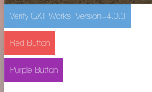

# Simple GXT Application with Theme module
This is a very basic GXT project with a theme module.   

## Generate Project
You can generate your own project based on this project using this [Maven Archtype](https://github.com/sencha/gxt-archetypes/tree/master/archetypes/gxt-theme-40x).

## Requirements

* [Java JDK](https://docs.sencha.com/gxt/4.x/guides/getting_started/Versions.html) - ([GXT Versions Matrix Reference](https://docs.sencha.com/gxt/4.x/guides/getting_started/Versions.html))
* [Apache Maven](https://maven.apache.org/install.html)
* [Access to Sencha Maven Artifactory](http://docs.sencha.com/gxt/4.x/guides/getting_started/maven/Maven.html) - This will give you access to GXT 4.0.3.

## IDE
Importing the project into the IDE. 

1. Run `mvn install` from the project root to build the theme. 
    * The reason this is done to start with is to generate the theme source files which will be in the generated source directory.
2. Import this project into your IDE as Maven project.
3. Create a launcher in the IDE for the application.
    * Eclipse - Right click and debug as GWT Development Mode with Embedded Jetty Server.
    * IntellJ IDEA - Create a GWT launcher.

## Building the theme
The theme was copied from Triton and renamed as Tritium for example. 

### Full Build
Running `mvn install` from the root of the project will do a full project build which includes the theme. 

### Theme Only Build
Running `mvn install` from the theme module, or theme folder, will allow you to only build the theme. 

## Theme Reference

* [Generating Theme Guide](https://docs.sencha.com/gxt/4.x/guides/ui/theme/GeneratingThemes.html)
* [Theme Utilities Guide](https://docs.sencha.com/gxt/4.x/guides/ui/theme/Utilities.html)
* [About GSS Guide](https://docs.sencha.com/gxt/4.x/guides/ui/style/gss/GSS.html)
* [GSS Syntax Guide](https://docs.sencha.com/gxt/4.x/guides/ui/style/gss/GSSSyntax.html)
* [GSS to CSS Guide](https://docs.sencha.com/gxt/4.x/guides/ui/style/gss/CssToGss.html)

### Using Client Bundles
Client bundles are ideal for encapsulating reuseable code. Like we do with Appearances. 
I like to suggest using gss variables in a global gss file that cascades into all of your client bundles so you only have one place for global values. Check out the [Theme Utilities](https://docs.sencha.com/gxt/4.x/guides/ui/theme/Utilities.html) for using the Themebuilder theme values. 

* [Client Bundling and Styles](https://docs.sencha.com/gxt/4.x/guides/ui/style/ClientBundleStyleAndImages.html)

### Extending the theme
Extending the theme allows you full control of the GSS, styles, and widget look and styling. 

#### Extending Button Appearance Example

* [Project EntryPoint with buttons](https://github.com/sencha/gxt-demo-projects/blob/master/gxt-theme-40x/application/src/main/java/tld/domain/project/client/ProjectEntryPoint.java#L36)
* [Red Button Appearance](https://github.com/sencha/gxt-demo-projects/tree/master/gxt-theme-40x/theme/src/main/java/tld/domain/project/theme/tritium/custom/client/button/red)
* [Purple Button Appearance](https://github.com/sencha/gxt-demo-projects/tree/master/gxt-theme-40x/theme/src/main/java/tld/domain/project/theme/tritium/custom/client/button/purple)

#### Extending GXT Appearances
This video covers extending the GXT appearance, and providing your own css styling.

* [Button Extension From this Repo](https://github.com/sencha/gxt-demo-projects/tree/master/gxt-theme-40x/theme/src/main/java/tld/domain/project/theme/tritium/custom/client/button)
* [ButtonCellAppearance Extension Example](https://gist.github.com/branflake2267/18dd8030595f67c0c43ea192353aff3d)

#### Theme File Locations
This images covers where the theme module stores the themes appearances and associated ClientBundle resources. 

* NOTE: The `Triton*` class names in the image have been renamed to `Tritium*`.

## Tips & Tricks
There is more than one to style widgets. Check out some of the tips and tricks for ideas. 
(Check out the example images at the bottom of the gists.)

### Misc

- Another way to style a **tip**. [See the gist.](https://gist.github.com/branflake2267/c7bc3c475060a45e5bea56954c2fe738)
- Another way to style a **progress bar**. [See the gist.](https://gist.github.com/branflake2267/52a972d87056aa486ba9)
- Custom **slider** example. [See the gist.](https://gist.github.com/branflake2267/bec9089f63fa40574e6604151468beaf)
- Custom **toggle button**. [See the gist.](https://gist.github.com/branflake2267/737aa0e319edf818d6a73c937ea61730)
- Showing an **icon** when **hovering** over header. [See the gist.](https://gist.github.com/branflake2267/23e20515fd4e9cf6e5849ce2382bf998)
- **Text area** resizing. [See the gist.](https://gist.github.com/branflake2267/7da92d23ddffeb5ac8beb6b94978bd8a)
- Custom **datepicker**. [See the gist.](https://gist.github.com/branflake2267/1ebdcb0dc6ae962550d985b6c89f0c0b)
- **Combo** with multiple **checkboxes**. [See the gist](https://gist.github.com/branflake2267/7461fd4cd83f53c8c4a3152104213ef6)

### Animations

- **Blinking** border. [See the gist.](https://gist.github.com/branflake2267/cbe962dedaef6e8e1954285c496767b2)
- CSS3 **marquee** animation. [See the gist.](https://gist.github.com/branflake2267/b250e1d6b2b43a1535d25146cbb4980a)

### Buttons

- Another way to change the **button color** for modern browsers only. [See the gist.](https://gist.github.com/branflake2267/cb0d0046f26e8c4776a170b4818fa3be)
- Custom tool button using icon. [See the gist.](https://gist.github.com/branflake2267/d3df69c1e4867f9aade28c2ff641835a)
- Another way to style toggle buttons. [See the gist.](https://gist.github.com/branflake2267/89e1e1552371879539e30b1254bd65d8)
- Another way to style the tab panel bar. [See the gist.](https://gist.github.com/branflake2267/0729169213c570243f369146d326d606)

### Grids

- Another way to **style the grid** using the ViewConfig. [See the gist.](https://gist.github.com/branflake2267/c1bf2512a8fd579978861b7c703260b5)
- Another way to style the **grid selection** (1). [See the gist.](https://gist.github.com/branflake2267/e57c2a96bb854d8a3fe42bcfe5b80b5f)
- Another way to style the **grid selection** (2). [See the gist.](https://gist.github.com/branflake2267/c16f6b9029347b3e70d89912aed8cc9d)
- Another way to style the **grid selection** (3). [See the gist.](https://gist.github.com/branflake2267/c1bf2512a8fd579978861b7c703260b5)
- Another way to show the **dirty icon** in the grid. [See the gist.](https://gist.github.com/branflake2267/58d2a7dfc3458a60843a13cb944ec192)
- Another way to **disable the button** in a grid (1). [See the gist.](https://gist.github.com/branflake2267/1c4fca8998a8d6e71d388237f3d1b6c0)
- Another way to **disable the button** in a grid (2). [See the gist.](https://gist.github.com/branflake2267/7ddd8f7feee9f25d31befccf852c774b)
- Split grid or **locking grid** example. [See the gist.](https://gist.github.com/branflake2267/d5f7b546f7c0dbe83df07a2d4d687695)
- Custom row **expander** button. [See the gist.](https://gist.github.com/branflake2267/f154f6b7759e629528c4b9255d3ee7a9)
- Custom **filter icon**. [See the gist.](https://gist.github.com/branflake2267/6b375ebd7e70e335f45a6fbab9e18d77)

### Trees

- Another way to layout cells in a grid. [See the gist.](https://gist.github.com/branflake2267/774570b920d13e4b112b1cb49a6ce68c)
- Another way to layout the **tree**. [See the gist.](https://gist.github.com/branflake2267/df29948ae4e5de7b4cc0e289f0c96b88)

### Containers

- Another way to color headers in a **BorderLayoutContainer**. [See the gist.](https://gist.github.com/branflake2267/1d2ec468062c5966a7f2f2ae6050594a)
- Another way to use HTML layout and css to layout. [See the gist.](https://gist.github.com/branflake2267/ec75a7a8fe7b056e7253e932fea94da8)
- **Fluid Layout**. [See the gist.](https://gist.github.com/branflake2267/eaf371b29bfdc4e3210a17615c4559a5)
- Center and scroll container. [See the gist.](https://gist.github.com/branflake2267/c070d81611b1858d1272ab77b826626c)

### Error Handling

- Another way to style your error handler. [See the gist.](https://gist.github.com/branflake2267/a51295fe09f6f8696476c3c383ac0731)

### Icons

- **Font Awesome** example with flexible layout. [See the gist](https://gist.github.com/branflake2267/34eff42cd92d71fe02bc6a27d7856a81)
- **Material icons**. [See the Explorer Example.](http://examples.sencha.com/gxt/4.0.3/#ExamplePlace:html_materialicons)

### Fonts

- **Web Fonts**. [See the Explorer Example.](http://examples.sencha.com/gxt/4.0.3/#ExamplePlace:html_webfont)

### Extending Appearances

- Extending the appearance. [See the gist.](https://gist.github.com/branflake2267/201e80954f1ea3158559dc099ec9a0c8)

### ImageResource

- Hacking the ImageResource. [See the gist.](https://gist.github.com/branflake2267/938b7f6fc22da1417b39)

### Embedded Layout

- Embedding your app. [See the gist.](https://gist.github.com/branflake2267/d2fec9bcfb5c5dea8cb78dc6528f0b42)

### DND Images

- Dropping images on the window (1). [See the gist.](https://gist.github.com/branflake2267/d424e4a0c0b371e3dd9d15bfd3514429)
- Doprring images on the window (2). [See the gist.](https://gist.github.com/branflake2267/97266601f0f225ae2a750fc8115dc2c4)

### SVG

- Resize SVG. [See the gist](https://gist.github.com/branflake2267/25d12cc2837261efc5859436af169528)

